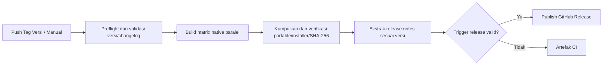

# Git Workflow CLI

Pasang satu skill Git Workflow berisi 12 command melalui CLI yang tersedia di PATH. Jalankan dari root atau subdirektori repo tanpa menyalin installer ke setiap proyek. Git Workflow **2.14.0** memakai satu versi untuk skill, CLI, dan distribusinya. Satu file sumber `git_workflow.py` memuat CLI, payload skill, dan logika install/uninstall; executable native dibangun dari sumber yang sama.

## Distribusi release

| Distribusi | Artefak | Isi dan kebutuhan |
| --- | --- | --- |
| Windows x64 | `git-workflow-2.14.0-windows-x64.zip` | Executable mandiri, `install-cli.ps1`, `uninstall-cli.ps1`, dan panduan; Python tidak diperlukan |
| Linux x64 | `git-workflow-2.14.0-linux-x64.tar.gz` | Executable mandiri, `install-cli.sh`, `uninstall-cli.sh`, dan panduan; dibangun di Ubuntu 22.04 |
| macOS x64 | `git-workflow-2.14.0-macos-x64.tar.gz` | Executable Intel, `install-cli.sh`, `uninstall-cli.sh`, dan panduan; Apple Silicon membutuhkan Rosetta |
| Python lintas OS | `git_workflow.py` | CLI standalone dengan payload skill; membutuhkan Python 3.9+ tanpa dependensi tambahan |

Nama arsip mengikuti versi Git Workflow yang dirilis. `SHA256SUMS.txt` menyertai keempat distribusi. Binary belum ditandatangani/notarized. Git diperlukan untuk menjalankan alur kerja Git melalui agent, sedangkan pemasangan skill memakai engine Python yang sudah dibundel.

## Pasang CLI pada PATH

Unduh arsip sesuai OS dari tab Releases repo, periksa checksum yang sesuai, lalu ekstrak seluruh isinya. Helper hanya memasang executable dan mendaftarkan PATH; pemasangan skill dilakukan terpisah melalui `git-workflow install`.

Windows, jalankan PowerShell dari folder hasil ekstraksi sebagai akun pengguna biasa:

```powershell
Get-FileHash .\git-workflow-2.14.0-windows-x64.zip -Algorithm SHA256  # sebelum ekstraksi
.\install-cli.ps1
```

Executable dipasang ke `%LOCALAPPDATA%\Programs\git-workflow\bin` dan direktori tersebut ditambahkan ke user PATH. Buka terminal baru setelah pemasangan. Gunakan `-WhatIf` untuk preview, `-InstallDir PATH` untuk tujuan lain, atau `-NoPathUpdate` untuk mengelola PATH sendiri.

Linux/macOS, jalankan dari folder hasil ekstraksi:

```sh
# Linux: sha256sum git-workflow-2.14.0-linux-x64.tar.gz
# macOS: shasum -a 256 git-workflow-2.14.0-macos-x64.tar.gz
sh ./install-cli.sh
```

Executable dipasang ke `~/.local/bin`. Jika direktori belum ada di PATH, helper mendaftarkannya pada `.zshrc` untuk zsh, `.bashrc` dan profil login aktif untuk bash, atau `.profile` untuk sh/dash/ksh. Untuk shell lain seperti fish, helper memberikan petunjuk agar Anda mengatur PATH melalui konfigurasi shell tersebut. Buka terminal baru. Opsi `--bin-dir PATH`, `--profile PATH`, dan `--no-path-update` tersedia; `--profile` memilih satu file konfigurasi dengan sintaks shell POSIX. Anda juga dapat menyalin executable secara manual ke direktori yang sudah ada di PATH.

## Uninstall CLI

Jalankan helper dari folder arsip release yang sudah diekstrak, atau dari `scripts/` pada checkout sumber. Helper tidak membutuhkan executable di sebelahnya saat uninstall.

Windows:

```powershell
.\uninstall-cli.ps1 -WhatIf           # preview
.\uninstall-cli.ps1
# Tujuan khusus harus sama dengan saat install:
.\uninstall-cli.ps1 -InstallDir 'D:\Tools\git-workflow'
```

Helper menghapus `git-workflow.exe` dan catatan instalasi `.git-workflow-cli.json` dari tujuan pemasangan. Entri user PATH hanya dihapus jika catatan tersebut menunjukkan bahwa installer menambahkannya; PATH yang sudah ada sebelum install dipertahankan. Instalasi lama atau penyalinan manual tanpa catatan tetap dapat dihapus, tetapi entri PATH perlu ditinjau/dihapus manual. `-NoPathUpdate` melewati pembersihan PATH.

Linux/macOS:

```sh
sh ./uninstall-cli.sh --dry-run      # preview
sh ./uninstall-cli.sh
# Gunakan kembali tujuan/profil khusus yang dipakai saat install:
sh ./uninstall-cli.sh --bin-dir /path/to/bin --profile /path/to/profile
```

Helper menghapus `git-workflow` dari `~/.local/bin` atau `--bin-dir`. Pembersihan PATH hanya menghapus blok lengkap yang ditambahkan installer pada `.bashrc`, `.bash_profile`, `.bash_login`, `.profile`, dan `.zshrc`, atau satu profil yang dipilih melalui `--profile`. Blok yang telah diedit dan konfigurasi lain dipertahankan untuk ditinjau manual. `--no-path-update` melewati pembersihan profil. PATH yang diatur manual, termasuk konfigurasi fish, tetap perlu dibersihkan manual.

Buka terminal baru setelah uninstall. File lain di direktori pemasangan dan skill agent tetap tersimpan. Untuk menghapus skill juga, jalankan `git-workflow uninstall --apply` untuk proyek atau `git-workflow uninstall --global --apply` **sebelum** menghapus CLI; gunakan `--agent ID` untuk memilih agent.

## Pakai CLI

```sh
git-workflow --help
git-workflow --version
git-workflow setup                   # pilih agent dan cakupan secara interaktif
git-workflow agents                  # ID agent dan lokasi pemasangan
git-workflow menu                    # menu interaktif
git-workflow commands                # pohon command CLI dan agent

cd /path/to/repo/subdirectory
git-workflow install                 # preview; mendeteksi root repo
git-workflow install --apply         # memasang skill pada repo
git-workflow status                  # periksa manifest dan hash secara read-only
git-workflow install --agent codex --global --apply
git-workflow install --agent claude-code,cursor --apply
git-workflow status --agent cursor
git-workflow uninstall --agent cursor --apply
git-workflow uninstall               # preview penghapusan skill proyek
git-workflow uninstall --apply
git-workflow uninstall --global --apply
```

`--project PATH` tetap tersedia untuk target eksplisit, termasuk folder proyek yang belum menjadi repo. `--replace` mempertahankan mekanisme backup dan pemeriksaan konflik engine lama. Tanpa argumen, CLI membuka menu jika stdin/stdout merupakan terminal interaktif yang mendukung tampilan; pada pipe, CI, atau terminal `dumb`, CLI menampilkan bantuan. Opsi lama seperti `git-workflow --apply` juga diterima.

### Pilih agent dan cakupan

`git-workflow setup` membuka pilihan agent, cakupan repo/global/path eksplisit, preview tujuan/file, dan konfirmasi penerapan. Masukkan ID agent dipisahkan koma, misalnya `codex,cursor`, atau `all`. `git-workflow menu` menyediakan alur yang sama untuk install/update, status dan uninstall. Pilihan agent menentukan tujuan integrasi; agent lain yang membaca direktori kompatibel tetap dapat menemukan skill tersebut.

Untuk terminal otomatis/CI, gunakan `install --agent ID --apply`; `setup --agent ID` juga memakai alur install tanpa prompt. `--agent` dapat diulang atau memakai koma. Alias tersedia: `claude`, `antigravity`, `roo`, `copilot`, `kimi`, `kimi-code-cli`, `kiro-cli`, `kilo`, `hermes-agent`, `omp`, `zen`, dan `zcode`. Sesuai penamaan pengguna, `zcode` di CLI ini berarti **Zencoder/Zen CLI**, bukan produk ZCode lain.

Instalasi baru tanpa `--agent` memakai **Codex**. Pada pemasangan yang sudah memiliki manifest, install/status/uninstall tanpa selector berlaku untuk seluruh agent yang tercatat pada cakupan itu. `--agent all` memilih seluruh 20 target; Cline dan Roo Code dipisahkan, serta Antigravity CLI tetap tersedia selain IDE/2.0. Installer memasang skill untuk agent terpilih tanpa memasang aplikasi agent itu sendiri.

### Pemetaan discovery skill

Tabel berikut menunjukkan direktori default. Di setiap lokasi, installer membuat subdirektori `git-workflow/` berisi `SKILL.md`, `VERSION`, referensi dan skrip. `~` berarti home pengguna tempat agent berjalan. Pemetaan diperiksa pada 8 Oktober 2026; dukungan bergantung versi aplikasi dan pengaturan discovery yang aktif.

| Agent / ID CLI | Repo | Global pengguna | Dokumentasi |
| --- | --- | --- | --- |
| Claude Code / `claude-code` | `.claude/skills/` | `~/.claude/skills/` | [Claude Code](https://code.claude.com/docs/en/skills) |
| Codex / `codex` | `.agents/skills/` | `~/.agents/skills/` | [OpenAI](https://learn.chatgpt.com/docs/build-skills) |
| Antigravity IDE/2.0 / `antigravity-ide` | `.agents/skills/` | `~/.gemini/config/skills/` | [Antigravity](https://antigravity.google/docs/skills) |
| Antigravity CLI / `antigravity-cli` | `.agents/skills/` | `~/.gemini/antigravity-cli/skills/` | [Antigravity](https://antigravity.google/docs/skills) |
| OpenCode / `opencode` | `.opencode/skills/` | `~/.config/opencode/skills/` | [OpenCode](https://opencode.ai/docs/skills/) |
| Cursor / `cursor` | `.cursor/skills/` | `~/.cursor/skills/` | [Cursor](https://cursor.com/help/customization/skills) |
| Cline / `cline` | `.cline/skills/` | `~/.cline/skills/` | [Cline](https://docs.cline.bot/customization/skills) |
| Roo Code / `roo-code` | `.roo/skills/` | `~/.roo/skills/` | [Roo Code](https://docs.roocode.com/features/skills) |
| Amp / `amp` | `.agents/skills/` | `~/.config/agents/skills/` | [Amp](https://ampcode.com/docs/customize/skills) |
| Gemini CLI / `gemini-cli` | `.gemini/skills/` | `~/.gemini/skills/` | [Gemini CLI](https://geminicli.com/docs/cli/skills/) |
| Hermes / `hermes` | `.hermes/skills/` | `~/.hermes/skills/` | [Hermes](https://hermes-agent.nousresearch.com/docs/user-guide/features/skills/) |
| GitHub Copilot / `github-copilot` | `.github/skills/` | `~/.copilot/skills/` | [GitHub](https://docs.github.com/en/copilot/how-tos/copilot-on-github/customize-copilot/customize-cloud-agent/add-skills) |
| Kimi Code / `kimi-code` | `.agents/skills/` | `~/.agents/skills/` | [Kimi Code](https://www.kimi.com/code/docs/en/kimi-code-cli/customization/skills.html) |
| Kiro IDE/CLI / `kiro` | `.kiro/skills/` | `~/.kiro/skills/` | [Kiro](https://kiro.dev/docs/skills/) |
| Qoder IDE/CLI / `qoder` | `.qoder/skills/` | `~/.qoder/skills/` | [Qoder](https://docs.qoder.com/extensions/skills) |
| Pi / `pi` | `.agents/skills/` | `~/.agents/skills/` | [Pi](https://github.com/badlogic/pi-mono/blob/main/packages/coding-agent/docs/skills.md) |
| Kilo Code / `kilo-code` | `.kilo/skills/` | `~/.kilo/skills/` | [Kilo Code](https://kilo.ai/docs/customize/skills) |
| TRAE / `trae` | `.trae/skills/` | `~/.trae/skills/` | [TRAE](https://docs.trae.ai/ide/skills) |
| Zencoder/Zen CLI / `zencoder` | `.agents/skills/` | `~/.agents/skills/` | [Zencoder](https://docs.zencoder.ai/features/skills) |
| Oh My Pi / `oh-my-pi` | `.omp/skills/` | `~/.omp/agent/skills/` | [Oh My Pi](https://github.com/can1357/oh-my-pi/blob/main/docs/skills.md) |

Paket mengikuti format Agent Skills. Lokasi native dipakai ketika dokumentasi menyediakannya; lokasi bersama dipakai untuk Codex, Antigravity, Amp, Kimi, Pi dan Zencoder. Dokumentasi Cline menyarankan `.cline/skills/`, sementara Zencoder menyarankan `.agents/skills/` dan menandai `.zencoder/skills/` deprecated. Metadata `agents/openai.yaml` hanya tambahan bagi host OpenAI; agent lain mengikuti `SKILL.md` beserta resource relatifnya.

Pemasangan repo pada lokasi bersama juga menambahkan rule `.agents/rules/git-workflow.md` dan blok pengarah di `AGENTS.md`. Pemasangan native seperti `.claude/skills/` atau `.cursor/skills/` memakai discovery skill bawaan dan tidak membutuhkan perubahan file pengaturan host. Semua cakupan repo menyimpan manifest di `.agents/git-workflow-install.json`; global memakai `~/.config/git-workflow/install.json`.

Manifest schema 2 menyimpan versi dan daftar file per agent. Install/update satu agent mempertahankan agent lain; update salinan bersama memperbarui versi semua pemilik salinan itu. Uninstall hanya menghapus file tanpa pemilik tersisa. Blok `AGENTS.md` dipertahankan selama masih ada pemilik rule bersama. Manifest lama tanpa pemetaan agent dikenali sebagai pemasangan Codex/Antigravity dan dimigrasikan tanpa kehilangan target lain. File yang dimodifikasi tetap memerlukan tinjauan atau `--replace`; backup, pemeriksaan symlink, preflight dan rollback tetap berlaku.

### Konfigurasi pengguna dan verifikasi host

CLI mengikuti `CLAUDE_CONFIG_DIR` untuk Claude Code, `XDG_CONFIG_HOME` untuk OpenCode/Amp, `HERMES_HOME` untuk Hermes, serta `PI_CODING_AGENT_DIR` untuk Oh My Pi. Oh My Pi juga mengikuti `OMP_PROFILE`/`PI_PROFILE` dengan root `~/.omp/profiles/<nama>/agent/`. Override harus merupakan path absolut, dan tujuan sebenarnya ditampilkan dalam preview. Default Pi memakai lokasi bersama `.agents/skills/` yang didokumentasikan, sehingga tidak bergantung pada profile native Pi.

Tujuan global dicatat dalam manifest. Jika environment/profile berubah, CLI berhenti sebelum mengubah instalasi lama: jalankan kembali dengan environment semula untuk uninstall, kemudian pasang pada environment baru. Ini mencegah penghapusan salinan yang salah. Untuk profile Oh My Pi yang dipilih hanya lewat flag aplikasi `--profile`, jalankan installer dengan `OMP_PROFILE` yang sama.

Setelah pemasangan, periksa discovery dalam aplikasi agent:

- Claude Code, Cursor, Antigravity, Qoder dan TRAE: buka ulang sesi atau daftar skill, lalu pilih Git Workflow. Cline menyediakan toggle skill pada pengaturan.
- Codex: pilih melalui `/skills` atau `$git-workflow`; bila belum muncul, buka ulang sesi.
- Gemini CLI: pastikan workspace dipercaya melalui `/trust`, lalu gunakan `/skills reload` dan `/skills list`. Aktivasi skill mengikuti izin Gemini sendiri.
- Hermes: untuk skill repo, jalankan `hermes skills trust` dari repo tersebut. Trust dilakukan oleh pengguna; installer tidak mengubah kebijakan trust.
- Kiro: agent bawaan menemukan skill otomatis. Agent kustom perlu resource `skill://.../SKILL.md` yang menunjuk lokasi skill repo/global sesuai [panduan Kiro CLI](https://kiro.dev/docs/cli/custom-agents/configuration-reference/).
- OpenCode: discovery memakai tool `skill`; pengaturan permission/agent dapat membatasi skill. Oh My Pi memerlukan provider native aktif untuk `.omp/skills/`; root user mengikuti profile aktif.
- Zencoder: dokumentasi skill saat ini menjelaskan discovery otomatis di Zenflow dan IDE Agents dari `.agents/skills/`. Alias `zen`/`zcode` memasang pada lokasi Zencoder tersebut; dokumentasi itu tidak menetapkan lokasi berbeda untuk Zen CLI, sehingga discovery pada versi Zen CLI tertentu masih perlu diverifikasi dalam sesi aplikasi. Skill dipilih otomatis berdasarkan konteks sesuai [dokumentasi Zencoder](https://docs.zencoder.ai/features/skills).
- Agent lain: pilih Git Workflow melalui fasilitas skill host atau tulis “gunakan Git Workflow untuk commitmsg”. Tidak semua host memakai bentuk slash command yang sama.

`git-workflow status --agent ID` memeriksa file dan manifest, bukan membuktikan skill sedang aktif dalam sesi agent. Pemasangan lokal/global pada komputer ini tidak otomatis memasang skill pada cloud agent atau host remote. Pengujian installer memakai direktori sementara; discovery dan eksekusi sesi nyata pada seluruh aplikasi agent belum diuji.

### Tampilan terminal dan menu

CLI Python dan executable memakai antarmuka yang sama, tanpa dependensi runtime tambahan:

| Komponen | Penggunaan |
| --- | --- |
| ASCII banner / logo | Logo dari `assets/banner/ASCIILogo.txt` dan versi paket pada menu serta operasi terminal |
| Command tree | `commands` menampilkan pohon command CLI dan katalog 12 command agent |
| Interactive menu | Pilih install/update, uninstall, status, command tree, atau help; pilih cakupan proyek/global/path eksplisit |
| Spinner / loading | Animasi selama membaca payload/manifest dan memeriksa hash pemasangan |
| Progress bar | Jumlah file yang selesai ditulis atau dihapus saat `--apply`; tidak memakai jeda buatan |
| Status / stepper | Tahap membaca metadata, menyusun rencana, memeriksa/menerapkan perubahan, dan hasil akhir |
| Panel / box | Ringkasan rencana, preview, hasil operasi, bantuan, dan panduan kesalahan |
| Table / tree view | Tabel tujuan, rencana file, hasil pemeriksaan, serta pohon command |
| Color & icon | Warna status dan ikon dengan fallback ASCII sesuai encoding terminal |
| Help & error guidance | `--help`, contoh penggunaan, dan langkah berikutnya pada pesan error |

Menu selalu menampilkan preview lebih dahulu, lalu meminta `Apply this plan? [y/N]`. Enter atau `n` mempertahankan preview; `y` menerapkan perubahan dengan pemeriksaan konflik dan backup yang sama. Menu dapat ditutup melalui `0`, Enter pada menu utama, atau Ctrl+C. Jika Ctrl+C terjadi saat penulisan/penghapusan file, CLI mencoba memulihkan perubahan yang sudah dilakukan dan keluar dengan kode 130; backup tetap tersedia.

`status` memeriksa hanya cakupan yang dipilih, termasuk versi tercatat serta file berubah/hilang berdasarkan hash manifest. Exit code: `0` untuk pemeriksaan tanpa perubahan file atau pemasangan tidak ditemukan, `1` untuk file berubah/hilang, dan `2` untuk argumen/metadata yang tidak valid. Gunakan agent untuk memeriksa salinan skill yang benar-benar aktif.

Untuk output sederhana atau pemakaian otomatis:

```sh
git-workflow install --plain
git-workflow status --global --plain
git-workflow commands --no-color
```

`--plain` menonaktifkan dekorasi, warna, animasi, dan menu otomatis. `--no-color` atau environment `NO_COLOR` menonaktifkan warna sambil mempertahankan layout terminal. Output yang diarahkan ke file/pipe, environment CI, dan `TERM=dumb` otomatis memakai output sederhana tanpa spinner, progress, atau prompt. Command `menu` yang diminta secara eksplisit membutuhkan stdin/stdout terminal dan tidak tersedia di CI. `--version` tetap menghasilkan satu baris sederhana.

Saat menjalankan sumber di repo, banner dibaca dari `assets/banner/ASCIILogo.txt`. Salinan logo juga dibundel pada konstanta `BANNER` di `git_workflow.py` agar file Python standalone dan executable dapat berjalan tanpa folder assets. Jika logo diubah, perbarui salinan `BANNER` agar sama; preflight memeriksa kecocokannya sebelum build. Terminal sempit memakai banner ringkas, dan terminal dengan encoding terbatas memakai karakter ASCII.

CLI mengelola pemasangan skill. Command `commitmsg`, `gitpush`, dan command Git lainnya dijalankan sebagai pesan kepada agent melalui `$git-workflow commitmsg` di Codex atau `/git-workflow commitmsg` di Antigravity. Terminal `git-workflow --version` menampilkan `Git Workflow 2.14.0`, yaitu versi paket skill yang akan dipasang; `$git-workflow --version` memeriksa salinan skill yang benar-benar aktif/terpasang. Salinan lama tetap menunjukkan versi pemasangannya sampai diperbarui dengan `install --apply`.

Distribusi Python dapat diunduh dan dijalankan sendiri. Simpan `git_workflow.py` di folder mana pun, lalu jalankan dari root atau subdirektori repo tujuan:

```sh
cd /path/to/repo/subdirectory
python3 /path/to/git_workflow.py install           # preview
python3 /path/to/git_workflow.py install --apply
python3 /path/to/git_workflow.py install --global --apply
python3 /path/to/git_workflow.py uninstall --apply
```

Python dan executable memakai opsi serta deteksi repo yang sama: tujuan mengikuti folder kerja terminal, bukan lokasi skrip. `--project PATH` tersedia untuk tujuan eksplisit. File ini tidak memerlukan modul lokal lain. Installer lama telah digabung ke sumber utama; distribusi Python tetap tersedia sebagai format keempat. Panduan lengkap command agent dan perlindungan installer ada di [Panduan-Git-Workflow.md](Panduan-Git-Workflow.md).

## Alur skill `gitrelease init`

Kirim `$git-workflow gitrelease init` kepada agent (atau gunakan bentuk pemanggilan skill host yang sesuai). `init` memeriksa repo/codebase: jenis produk, entrypoint, bahasa/toolchain, dependency dan lockfile, sumber versi, changelog, CI, packaging, dukungan OS/arsitektur, serta signing bila diperlukan.

Jika pilihan distribusi belum jelas, agent menanyakan platform/arsitektur serta format **portable, installer, atau keduanya**, disertai rekomendasi berdasarkan codebase. Pilihan yang sudah ditetapkan pengguna atau proyek dipakai langsung. Executable, arsip portable dan installer merupakan keluaran berbeda; distribusi `.py` memerlukan runtime Python dan bukan platform OS tambahan. Library, skrip dan service mengikuti bentuk distribusinya sendiri.

Untuk rute default `auto`/`workflow`, hasil lokal init mencakup:

- Versi proyek pada sumber otoritatif dan field turunannya yang memang terkait; versi valid yang sudah ada dapat dipertahankan.
- `CHANGELOG.md` atau lokasi changelog proyek yang sudah ada, dengan entri `## [versi] - YYYY-MM-DD`, kategori Added/Changed/Fixed/Removed/Security/Notes yang terisi, dan poin perubahan berbahasa Indonesia.
- Workflow build dan release; nama default `.github/workflows/build-multiplatform-release.yml`, atau workflow relevan yang sudah ada/path eksplisit.
- Helper validasi, ekstraksi notes dan packaging yang benar-benar dibutuhkan, beserta dokumentasi target, format, runtime dan kebutuhan signing.

Payload standalone membundel `references/release-workflow.md` dan `assets/release/build-multiplatform-release.yml.tmpl`. Agent mengadaptasi template dan membuat helper proyek berdasarkan toolchain aktual; template bukan workflow siap pakai tanpa penyesuaian. Struktur enam tahap pada bagian berikut menjadi kontrak untuk proyek lain. Semua placeholder dan path helper harus diselesaikan sebelum setup dinyatakan lengkap. Rute `direct` yang dipilih eksplisit menyiapkan build/packaging lokal tanpa membuat publisher otomatis tambahan.

Release notes default mengambil **hanya versi yang dirilis**, dengan judul `## Nama Proyek vVERSI` dan isi kategori changelog versi itu. Riwayat lama tetap disimpan di changelog. Tabel Download atau riwayat versi sebelumnya hanya ditambahkan jika format tersebut dipilih; format lama proyek tidak dimigrasikan diam-diam.

Init menyiapkan file lokal; artefak dihasilkan ketika build dijalankan. Agent melaporkan pemeriksaan aktual, platform yang belum dibangun dan kebutuhan eksternal yang belum tersedia. Init tidak otomatis melakukan commit, tag, push, dispatch CI atau publikasi. Trigger otomatis hanya push tag versi; push branch termasuk main tidak menjalankan workflow release. Manual dengan `publish=false` hanya build/verify; publish memerlukan tag yang sesuai versi/SHA serta semua keluaran wajib dan checksum SHA-256 terverifikasi.

## CI/CD



Workflow [build-multiplatform-release.yml](.github/workflows/build-multiplatform-release.yml) menggunakan Python dan PyInstaller sesuai codebase ini. Struktur build matrix dan catatan rilis mengikuti [workflow referensi](https://github.com/AlvinPradanaAntony/SI-Pemesanan-Kamar-Kos/blob/main/.github/workflows/build-multiplatform-release.yml); toolchain Java pada referensi diganti dengan toolchain Python.

- Push branch, termasuk `main`: workflow release tidak berjalan.
- Push tag `v2.14.0`: versi tag harus sama dengan `VERSION` dan memiliki changelog nonkosong; release hanya dipublikasikan setelah seluruh gate berhasil.
- Filter otomatis memakai `v*.*.*`, termasuk tag prerelease seperti `v2.14.0-rc.1`; preflight tetap memvalidasi SemVer secara tepat.
- Manual: `version` kosong memakai metadata CLI, `publish` default false. Untuk publish, tag versi harus sudah ada dan menunjuk commit yang sama dengan ref yang dipilih. Pilih ref tag tersebut agar build sesuai release. Tag baru atau release lama tidak diganti otomatis.

Untuk release berikutnya, ubah satu konstanta `VERSION` di `git_workflow.py`, tambahkan entri changelog versi yang sama, commit perubahan, dan push tag `vVERSION`. Output CLI, manifest pemasangan, file `VERSION` skill, nama arsip, dan metadata release mengikuti konstanta tersebut. File `VERSION` skill dihasilkan saat payload dimuat sehingga nomor versi tidak perlu disunting di dalam payload terkompresi. Preflight membaca konstanta langsung dari sumber dan merekam SHA-256 `git_workflow.py`; tahap collect/publish memeriksa artefak Python terhadap hash tersebut dan sumber commit yang disetujui.

PyInstaller menghasilkan executable sesuai OS dan arsitektur tempat build dijalankan, sehingga tiap OS memakai runner native ([dokumentasi PyInstaller](https://pyinstaller.org/en/stable/operating-mode.html)). macOS memakai `macos-15-intel` untuk target x64; Linux memakai Ubuntu 22.04 agar batas kompatibilitas glibc lebih rendah dibanding runner Ubuntu terbaru. Installer di sini berupa helper PATH dan installer skill Python, bukan paket MSI/DEB/PKG.

## Pengembangan

Jalankan langkah berikut dari **root repo**, menggunakan Python yang tersedia pada komputer Anda selama memenuhi batas minimum:

| Kebutuhan | Versi Python |
| --- | --- |
| CLI dan installer Python standalone | Python 3.9+ |
| Seluruh tes, helper release, dan build | Python 3.10+; versi lebih baru mengikuti dukungan dependensi build |
| Executable native yang sudah dibangun | Python terpasang tidak diperlukan |

Batas minimum helper release berasal dari penggunaan `Path.write_text(..., newline=...)`, yang tersedia sejak Python 3.10 ([dokumentasi Python](https://github.com/python/cpython/blob/main/Doc/library/pathlib.rst)). Untuk build distribusi x64, gunakan interpreter x64. Runtime CLI dan tes unit memakai standard library; PyInstaller hanya diperlukan untuk membangun executable. Versi PyInstaller di `requirements-build.txt` menentukan interpreter yang didukung saat build, dan pip memvalidasi kompatibilitas tersebut ketika dependensi dipasang. Virtual environment disarankan agar dependensi build terpisah dari Python sistem.

Workflow CI saat ini memilih Python 3.12 agar toolchain build konsisten. Pilihan CI tersebut tidak mengharuskan pengembangan lokal memakai versi minor yang sama.

Untuk tes helper lengkap di Windows, sediakan Git Bash dan PowerShell. Smoke test build Windows membutuhkan PowerShell 7 (`pwsh`). Tes helper yang membutuhkan shell tidak tersedia akan ditandai `skipped`; periksa ringkasan tes untuk mengetahui cakupan yang benar-benar dijalankan.

### 1. Buat dan aktifkan virtual environment

Windows PowerShell:

```powershell
python -m venv .venv
.\.venv\Scripts\Activate.ps1
```

Linux/macOS, bash atau zsh:

```sh
python3 -m venv .venv
source .venv/bin/activate
```

Perintah pembuatan environment memakai interpreter yang dirujuk `python` atau `python3` pada PATH. Di Windows, `py -3 -m venv .venv` juga dapat dipakai jika Anda menggunakan Python launcher. Jika `.venv/` sudah ada dengan versi Python yang memenuhi kebutuhan langkah yang akan dijalankan, cukup aktifkan kembali. Setelah aktivasi, perintah `python` dan `python -m pip` memakai interpreter dalam `.venv/`. Periksa sebelum melanjutkan:

```sh
python --version
python -c "import sys; print(sys.executable)"
```

Aktivasi bersifat opsional. Jika PowerShell memblokir skrip aktivasi atau Anda ingin menjalankan perintah tanpa aktivasi, gunakan interpreter environment secara langsung:

```powershell
.\.venv\Scripts\python.exe -m unittest discover -s tests -v
```

Linux/macOS memakai `.venv/bin/python` sebagai pengganti `python`. Pola yang sama berlaku untuk pip, CLI, dan helper release. Mekanisme ini mengikuti [dokumentasi venv Python](https://github.com/python/cpython/blob/main/Doc/library/venv.rst).

### 2. Pasang dependensi build

Dengan environment aktif:

```sh
python -m pip install -r requirements-build.txt
```

Langkah ini memasang versi PyInstaller yang dipatok dan dependensinya ke `.venv/`. Untuk hanya mengubah CLI atau menjalankan tes unit, langkah pemasangan dependensi build boleh dilewati.

### 3. Jalankan CLI dan tes unit

```sh
python git_workflow.py --help
python git_workflow.py --version
python -m unittest discover -s tests -v
```

Untuk menjalankan satu kelompok tes:

```sh
python -m unittest discover -s tests -p test_cli.py -v
python -m unittest discover -s tests -p test_path_installers.py -v
python -m unittest discover -s tests -p test_release.py -v
```

- `test_cli.py` menguji deteksi repo, preview, install/uninstall, idempotensi, konflik, backup, dan konsistensi versi saat memperbarui pemasangan lama pada repo contoh sementara. Tes menu mencakup navigasi, menolak/menerapkan preview, status, output plain, fallback ASCII, terminal sempit, dan rollback saat dibatalkan. Tes distribusi menyalin hanya `git_workflow.py` ke folder lain, lalu menjalankannya dalam proses Python terisolasi untuk memastikan file tersebut mandiri.
- `test_path_installers.py` menguji install/uninstall CLI, preview, pengulangan, direktori khusus, pembersihan blok shell, serta perlindungan file lain dan PATH yang sudah ada. Tujuan pemasangan dan profil shell memakai direktori sementara; tes PowerShell memakai `-NoPathUpdate` atau mock API user PATH. User PATH serta profil shell asli tidak diubah.
- `test_release.py` menguji versi, tag, changelog, isi arsip, arsitektur binary, dan checksum memakai fixture sementara. Arsip uji tersebut bukan executable native hasil build.
- `test_skill_release.py` menguji helper notes dari skill terpasang: versi yang tepat, penolakan entri hilang/duplikat/kosong, kesamaan format notes repo ini dan perlindungan changelog ketika menulis file hasil.

Tes menggunakan direktori sementara sistem (`%TEMP%` di Windows atau lokasi temporary sistem di Linux/macOS), lalu membersihkannya saat tes selesai. Python dapat membuat `__pycache__/` di root, `scripts/`, dan `tests/`. **Tes unit tidak membuat `.venv/`, `.release/`, `build/`, `dist/`, atau `artifacts/` di repo**, tidak memasang skill ke repo pengembangan/akun asli, dan tidak mempublikasikan GitHub Release.

### 4. Validasi lokal dan buat catatan rilis

```sh
python scripts/release.py preflight --event local --publish false --output .release/metadata.json
python scripts/release.py notes --version 2.14.0 --output .release/release-notes.md
```

Ganti `2.14.0` sesuai `VERSION` di `git_workflow.py` ketika menyiapkan versi berikutnya. Preflight memeriksa file proyek, versi paket, payload skill, dan changelog; mode lokal tidak mempublikasikan release. Kedua perintah ini menghasilkan metadata dan catatan rilis dalam `.release/`.

### 5. Build, smoke test, dan packaging native

Setelah dependensi build terpasang dan preflight berhasil, pilih **satu** perintah sesuai OS host x64:

```sh
# Windows x64
python scripts/release.py build --platform windows --metadata .release/metadata.json --out-dir artifacts

# Linux x64
python scripts/release.py build --platform linux --metadata .release/metadata.json --out-dir artifacts

# macOS Intel x64
python scripts/release.py build --platform macos --metadata .release/metadata.json --out-dir artifacts
```

Helper menjalankan PyInstaller, menguji executable dari subfolder repo sementara tanpa `--project`, menguji preview/install/uninstall serta helper PATH, kemudian memverifikasi dan membuat arsip native di `artifacts/`. File kerja PyInstaller, executable sebelum packaging, dan file `.spec` dibuat di direktori sementara sistem; file kerja build itu dibersihkan setelah helper selesai. Engine uninstall menyimpan backup file uji di direktori temporary dengan awalan `git-workflow-uninstall-backup-`; backup tersebut mengikuti perilaku installer dan dapat tetap tersedia setelah smoke test.

Build lokal hanya menghasilkan distribusi **OS host** dan membutuhkan runner/interpreter x64. Contohnya, host Windows menghasilkan ZIP Windows; build Linux dan macOS dijalankan pada host masing-masing melalui matrix GitHub Actions. Validasi checksum untuk empat distribusi dilakukan pada tahap collect setelah seluruh arsip native tersedia.

Untuk debugging build secara langsung dengan PyInstaller, jalankan:

```sh
python -m PyInstaller --noconfirm --clean --onefile --console --noupx --name git-workflow git_workflow.py
```

Perintah langsung ini menghasilkan `build/`, `dist/`, dan `git-workflow.spec` di root repo. Executable berada di `dist/git-workflow.exe` pada Windows atau `dist/git-workflow` pada Linux/macOS. Perintah tersebut belum menjalankan smoke test dan packaging yang dilakukan helper `scripts/release.py build`.

### File utama dan hasil eksekusi

File utama yang dikelola dalam Git adalah `git_workflow.py`, `assets/`, `scripts/`, `tests/`, `.github/workflows/`, `requirements-build.txt`, `.gitattributes`, `.gitignore`, `README.md`, `Panduan-Git-Workflow.md`, dan `CHANGELOG.md`.

| File/folder selain sumber utama | Dibuat oleh | Keterangan |
| --- | --- | --- |
| `__pycache__/`, `*.py[cod]` | Eksekusi/import Python, termasuk tes | Cache bytecode; bisa dibuat ulang otomatis |
| `.venv/` | `python -m venv .venv` dan pip | Interpreter serta dependensi lokal; bukan hasil tes |
| `.release/` | Preflight, ekstraksi notes, dan pipeline CI | Metadata, catatan rilis, arsip native/incoming, staging assets/checksum, serta file bantu pemeriksaan |
| `build/` | Build langsung PyInstaller | Analisis, log, dan file kerja build |
| `dist/` | Build langsung PyInstaller | Executable hasil build |
| `artifacts/` | Helper build dengan `--out-dir artifacts` | Arsip distribusi native siap diambil |
| `*.spec` | PyInstaller | Pada proyek ini dihasilkan ulang; helper menyimpannya di temporary, build langsung menyimpannya di root |
| `release-assets/` | Output staging jika nama/path ini dipilih | Pola cadangan dalam `.gitignore`; workflow saat ini memakai `.release/assets/` |
| `release-notes.md` | Ekstraksi notes jika output diarahkan ke root | Workflow dan contoh lokal memakai `.release/release-notes.md` |
| `preflight.json` | Preflight jika output diberi nama tersebut | Pola cadangan dalam `.gitignore`; contoh saat ini memakai `.release/metadata.json` |

Keadaan repo yang berisi `.venv/`, `__pycache__/`, `.release/`, `build/`, `dist/`, `artifacts/`, dan `git-workflow.spec` berasal dari **beberapa langkah pengembangan/build lokal**, bukan dari tes unit saja. Semua hasil tersebut sudah dikecualikan oleh `.gitignore`; pola ignore tidak berarti setiap file/folder itu pasti ada. Pada CI, `release-assets` juga merupakan nama artifact GitHub Actions, dengan isi yang berasal dari `.release/assets/`.

Hasil eksekusi boleh dibersihkan ketika sudah tidak dibutuhkan. Jika `.venv/` dihapus, ulangi langkah pembuatan environment dan pemasangan dependensi. Jika `dist/` atau `artifacts/` dihapus, executable/arsip lokal harus dibangun ulang. Metadata `.release/` dan cache Python juga dapat dibuat ulang. Setelah mengubah README, panduan, atau helper PATH, buat ulang arsip distribusi agar konten arsip sesuai sumber yang akan diverifikasi pipeline.

Untuk keluar dari environment yang diaktifkan:

```sh
deactivate
```
